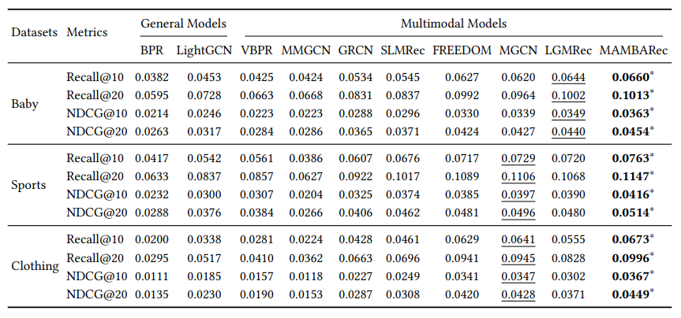

# MambaRec

## Introduction

>**[CIKM 2025]** Kelin Ren, Chan-Yang Ju, and Dong-Ho Lee(2025). Modality Alignment with Multi-scale Bilateral Attention for
 Multimodal Recommendation

## Enviroment Requirement
- Python 3.8 (ubuntu20.04)
- Pytorch 1.11.0
- CUDA 11.3

## Dataset  
Download from Google Drive: [Baby/Sports/Clothing](https://drive.google.com/drive/folders/13cBy1EA_saTUuXxVllKgtfci2A09jyaG?usp=sharing)  
The data comprises text and image features extracted from Sentence-Transformers and CNN.  

## How to run
1. Place the downloaded data (e.g. `baby`) into the `data` directory.
2. Enter the `src` folder and execute the following command:  
`python main.py -m MambaRec -d baby`  

Other parameters can be set either through the command line or by using the configuration files located in `configs/model/MambaRec.yaml` and `configs/dataset/*.yaml`.

## Performance Comparison

    

## Acknowledgement
The structure of this code is inspired by the [MMRec](https://github.com/enoche/MMRec) framework. We acknowledge and appreciate their valuable contributions.
